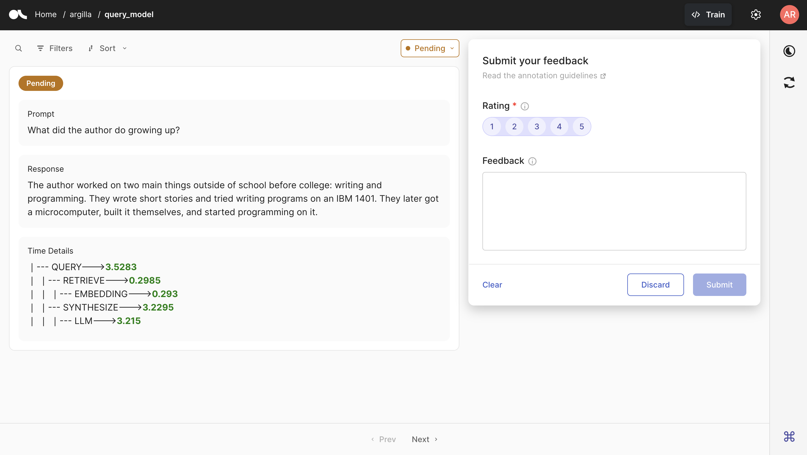
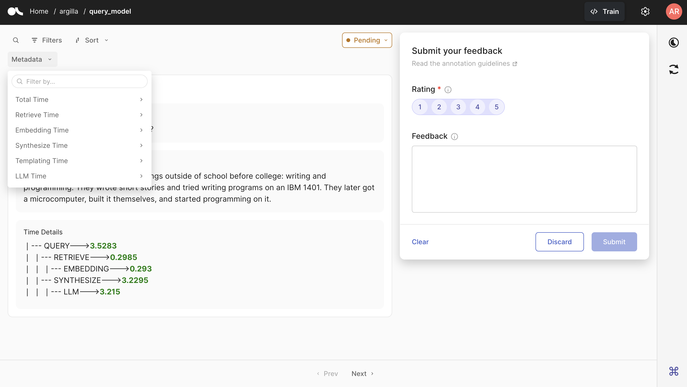

# Argilla-Llama-Index

Argilla is an open-source platform for data-centric LLM development. Integrates human and model feedback loops for continuous LLM refinement and oversight.

With Argilla's Python SDK and adaptable UI, you can create human and model-in-the-loop workflows for:

- Supervised fine-tuning
- Preference tuning (RLHF, DPO, RLAIF, and more)
- Small, specialized NLP models
- Scalable evaluation.

## Getting Started

You first need to install argilla and argilla-llama-index as follows:

```bash
pip install argilla-llama-index
```

You will need to an Argilla Server running to monitor the LLM. You can either install the server locally or have it on HuggingFace Spaces. For a complete guide on how to install and initialize the server, you can refer to the [Quickstart Guide](https://docs.argilla.io/en/latest/getting_started/quickstart_installation.html). 

## Usage

It requires just a simple step to log your data into Argilla within your LlamaIndex workflow. We just need to call the handler before starting production with your LLM.

We will use GPT3.5 from OpenAI as our LLM. For this, you will need a valid API key from OpenAI. You can have more info and get one via [this link](https://openai.com/blog/openai-api).

After you get your API key, let us import the key.

```python
import os
from getpass import getpass

openai_api_key = os.getenv("OPENAI_API_KEY", None) or getpass("Enter OpenAI API key:")
```

Let us make the necessary imports.

```python
from argilla_llama_index import ArgillaCallbackHandler
from llama_index import VectorStoreIndex, ServiceContext, SimpleDirectoryReader
from llama_index.llms import OpenAI
from llama_index import set_global_handler
```

What we need to do is to set Argilla as the global handler as below. Within the handler, we need to provide the dataset name that we will use. If the dataset does not exist, it will be created with the given name. You can also set the API KEY, API URL, and the Workspace name. If you do not provide these, the default values will be used.

```python
set_global_handler("argilla", dataset_name="query_model")
```

Let us create the LLM.

```python
llm = OpenAI(model="gpt-3.5-turbo", temperature=0.8)
```

With the code snippet below, you can create a basic workflow with Llama Index. You will also need a txt file as the data source within a folder named "data". For a sample data file and more info regarding the use of Llama Index, you can refer to the [Llama Index documentation](https://docs.llamaindex.ai/en/stable/getting_started/starter_example.html).


```python
service_context = ServiceContext.from_defaults(llm=llm)
docs = SimpleDirectoryReader("data").load_data()
index = VectorStoreIndex.from_documents(docs, service_context=service_context)
query_engine = index.as_query_engine()
```

Now, let us run the `query_engine` to have a response from the model. 

```python
response = query_engine.query("What did the author do growing up?")
```

```bash
The author worked on two main things outside of school before college: writing and programming. They wrote short stories and tried writing programs on an IBM 1401. They later got a microcomputer, built it themselves, and started programming on it.
```

The prompt given and the response obtained will be logged in to Argilla server. You can check the data on the Argilla UI.



And we also logged the metadata properties into Argilla. You can check them via the Filters on the upper left and filter your data according to any of them.




